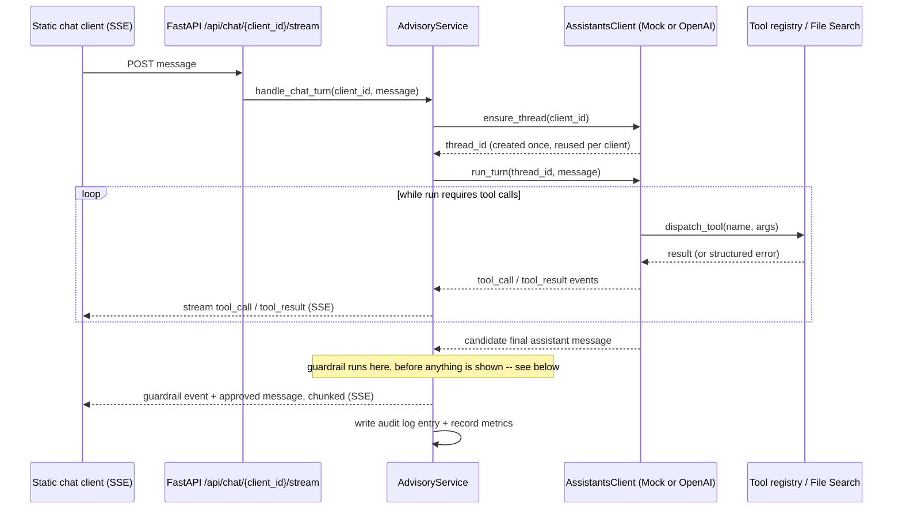
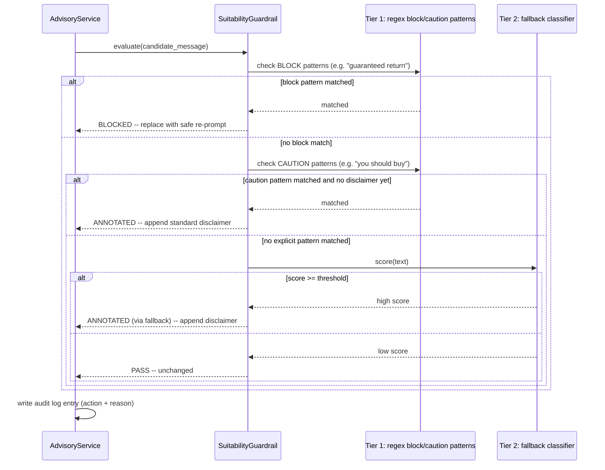

# Wealth Advisory Copilot: An OpenAI Assistants API System for Portfolio Guidance with Compliance Guardrails

> **Fictional bank, synthetic data.** "Northbridge Financial Group" is an invented
> bank brand created solely for this demo -- it is not a real company. Every
> client, portfolio, holding, and fund fact sheet in this repository is synthetic
> data generated for demonstration purposes.
>


## Why this exists

Regulated financial institutions increasingly want agentic AI systems that can
call real tools, ground answers in retrieved documents, and stay inside
compliance guardrails -- not just chat. This repository is a hands-on,
runnable demonstration of that pattern end to end, built directly on the OpenAI
Assistants API's thread/run/tool-call model (function calling + File Search),
with a genuine offline mode so it can be evaluated by anyone without a paid API
key.

## Architecture

Layered, dependency-inverted design: `api` only knows HTTP, `service`
orchestrates the use case, `domain` is pure business logic with no I/O, and
`infrastructure` is the only layer allowed to talk to the OpenAI SDK, the
filesystem, or Prometheus.

```
app/api             FastAPI routes, request/response schemas, SSE framing
app/service          AdvisoryService: the run -> guardrail -> audit-log pipeline
app/domain           Pydantic models + synthetic seed data (no I/O)
app/infrastructure   OpenAI client, MockAssistantsClient, audit log, fund
                      fact-sheet store, circuit breaker, Prometheus metrics
app/tools             Function-calling tool implementations
app/guardrails        Suitability guardrail middleware
app/core              Settings, structured logging, tracing spans
```

### Assistants lifecycle (thread / run / tool-call loop)

Both `MockAssistantsClient` (offline) and `OpenAIAssistantsClient` (live)
implement the same loop shape -- this is what lets the app run with zero paid
API keys by default and switch to the real OpenAI Assistants API the moment
`OPENAI_API_KEY` is set, with no other code changes.



### Guardrail decision path



## Key Design Decisions

1. **Buffer-then-stream, not raw token streaming.** The guardrail evaluates the
   *complete* candidate assistant message, not a live token stream, because a
   compliance check cannot meaningfully vet half a sentence. The UI's
   "streaming" effect is the already-approved message being re-chunked after
   the fact. Tradeoff: slightly higher latency-to-first-token than raw
   provider streaming, in exchange for never showing un-vetted output.
2. **Deterministic offline mode is a first-class feature, not a test stub.**
   `MockAssistantsClient` fully simulates the thread/run/tool-call lifecycle
   (including tool-selection heuristics and File Search) so the entire app,
   README instructions, and CI pipeline work with zero paid API keys. The
   tradeoff is that the mock's "model reasoning" is keyword-based, not a real
   LLM -- it's an honest stand-in for demonstrating the *pattern*, not a
   claim of matching real model behavior.
3. **Two-tier guardrail (regex + fallback heuristic), not a single LLM call.**
   Explicit regex/keyword rules are fast, free, fully explainable, and
   unit-testable with zero flakiness -- important for a compliance-adjacent
   control. A fallback classifier only runs when the explicit rules find
   nothing, to catch paraphrased risky language. In this repo the fallback is
   a small dependency-free heuristic (not a live model call) so the guardrail
   stays deterministic in CI; `LlmSuitabilityClassifier` documents the
   production extension point.
4. **No frontend framework.** The chat client is plain HTML/CSS/vanilla JS
   reading a hand-parsed SSE stream from a POST response. This keeps the demo
   dependency-free and build-step-free, and deliberately keeps this portfolio
   repo's frontend distinct from a separate Next.js-based repo elsewhere in
   the same portfolio.
5. **In-memory synthetic data, not a database.** Client/portfolio seed data
   lives in `app/domain/seed_data.py` as plain Python objects. This keeps the
   demo trivially runnable with no database setup, at the cost of not
   demonstrating persistence -- a real deployment would back this with a
   proper data store and would also need per-caller authorization on
   `client_id`.

## Governance & Guardrails

See [`GOVERNANCE.md`](./GOVERNANCE.md) for the full write-up. Summary: every
outgoing assistant message is scanned by `SuitabilityGuardrail`
(`app/guardrails/suitability_guardrail.py`) before it reaches the user. It
either passes the message unchanged, appends a standard compliance disclaimer
(`ANNOTATED`), or replaces the message entirely with a safe explanation
(`BLOCKED`) when it detects language implying a guaranteed or risk-free
investment outcome. Every run -- every tool call, every guardrail decision --
is written to an append-only audit log (`logs/audit_log.jsonl`).

**This is explicitly not a certified compliance control.** It is a simplified,
illustrative pattern demonstrating how a guardrail can be wired into an
agentic pipeline: regex heuristics are brittle, there is no real
authentication/authorization on `client_id`, and the audit log is a local file,
not a tamper-evident ledger. See `GOVERNANCE.md` for the full limitations list
and what a production version would need to add.

## Getting Started

Requires Python 3.11+. No `OPENAI_API_KEY` needed for any of this.

```bash
git clone <this-repo-url>
cd openai-assistants-advisory-copilot

python -m venv .venv
source .venv/bin/activate          # Windows: .venv\Scripts\activate

make install                        # pip install -r requirements-dev.txt
make test                            # pytest -v  (24 tests, fully offline)
make run                              # uvicorn app.main:app --reload
```

Then open **http://localhost:8000/** for the chat UI, or try the API directly:

```bash
curl http://localhost:8000/healthz
curl http://localhost:8000/readyz
curl http://localhost:8000/api/clients

curl -N -X POST http://localhost:8000/api/chat/NB-1001/stream \
  -H "Content-Type: application/json" \
  -d '{"message": "What are my current holdings and how far off is my allocation from target?"}'
```

Try `"Can you guarantee returns on this fund?"` against any client to see the
guardrail's `BLOCKED` path fire end to end (the mock model is deliberately
"baited" into unsafe phrasing on a couple of trigger phrases specifically to
demonstrate the guardrail catching it -- see
`app/infrastructure/mock_assistants_client.py`).

To run against the real OpenAI Assistants API instead, copy `.env.example` to
`.env`, set `OPENAI_API_KEY`, and re-run `make run` -- `client_factory.py`
picks up the live client automatically with no other changes.

### One-command Docker spin-up

```bash
docker compose up --build
```

## Production Deployment

- **Docker**: multi-stage `Dockerfile`, pinned `python:3.11.10-slim-bookworm`
  base, non-root `appuser` (uid 1000), container `HEALTHCHECK`.
- **Kubernetes**: manifests under `deploy/k8s/` (`Deployment`, `Service`,
  `ConfigMap`, `HorizontalPodAutoscaler`) with liveness/readiness probes wired
  to `/healthz` / `/readyz`, a restricted `securityContext`, and an optional
  `Secret` reference for `OPENAI_API_KEY` (absent -> the pod runs in offline
  mock mode, same as local dev).
- **OpenShift**: see [`deploy/OPENSHIFT.md`](./deploy/OPENSHIFT.md) for SCC,
  Route, and BuildConfig notes.
- **CI**: `.github/workflows/ci.yml` runs `ruff`, `mypy`, `pytest` (all with no
  API key set, proving the offline path), then a Docker build, on every
  push/PR.

### Observability

- **Structured logs**: JSON lines with a `correlation_id` (the run id) on
  every log line for a given chat turn -- see `app/core/logging_config.py`.
- **Tracing spans**: `app/core/tracing.py` wraps each run in a named span
  (start/end/duration) via structured logs; the shape maps 1:1 onto an
  OpenTelemetry span if you swap in `opentelemetry-sdk` in a real deployment.
- **Prometheus**: `/metrics` exposes `assistant_runs_total`,
  `tool_calls_total{tool_name,succeeded}`, `guardrail_actions_total{action}`,
  and `assistant_run_duration_seconds`. Point a Prometheus scrape config at
  this endpoint and build a Grafana dashboard on top of those four metrics for
  run volume, tool health, guardrail intervention rate, and latency.
- **Per-client token/cost tracking (roadmap)**: the real OpenAI SDK response
  includes token usage per run; `AdvisoryService.handle_chat_turn` is the
  single seam where a `tokens_used_total{client_id}` counter and a
  cost-per-run estimate would be added next to the existing metrics.

## Tech Stack

| Layer               | Technology                                                        |
|---------------------|----------------------------------------------------------------------|
| Language             | Python 3.11+                                                          |
| Agent framework      | OpenAI SDK -- Assistants API (threads/runs/tool-calls, File Search)   |
| Web framework        | FastAPI + Uvicorn                                                      |
| Validation            | Pydantic v2 / pydantic-settings                                       |
| Resilience             | tenacity (retries, backoff+jitter) + hand-rolled circuit breaker      |
| Frontend               | Static HTML/CSS + vanilla JS (SSE client), no framework                |
| Testing                | pytest, pytest-asyncio                                                  |
| Lint / types             | ruff, mypy                                                                |
| Observability           | Prometheus client, structured JSON logging, lightweight tracing spans   |
| Containerization        | Docker (multi-stage, non-root), docker-compose                           |
| Orchestration            | Kubernetes manifests (+ OpenShift notes)                                  |
| CI                        | GitHub Actions (lint, type-check, test, Docker build)                     |

## Repository Structure

```
openai-assistants-advisory-copilot/
|-- app/
|   |-- api/                  # FastAPI routers, schemas, DI wiring
|   |-- service/                # AdvisoryService: the orchestration pipeline
|   |-- domain/                  # Pydantic models + synthetic seed data
|   |-- infrastructure/           # OpenAI client, mock client, audit log,
|   |                               # fund fact-sheet store, circuit breaker, metrics
|   |-- tools/                     # Function-calling tool implementations
|   |-- guardrails/                 # Suitability guardrail middleware
|   |-- core/                        # Settings, logging, tracing
|   `-- main.py                       # Composition root / FastAPI app factory
|-- static/                            # Vanilla JS/HTML/CSS chat client (SSE)
|-- data/fund_factsheets/                # Synthetic Northbridge fund fact sheets
|-- tests/                                # pytest suite (mock lifecycle, tools,
|                                            # guardrail, audit log, API smoke)
|-- deploy/
|   |-- k8s/                                 # Deployment / Service / ConfigMap / HPA
|   `-- OPENSHIFT.md                          # OpenShift-specific deployment notes
|-- .github/workflows/ci.yml                    # Lint, type-check, test, Docker build
|-- Dockerfile                                    # Multi-stage, non-root
|-- docker-compose.yml                              # One-command local spin-up
|-- Makefile                                          # install / test / lint / run
|-- GOVERNANCE.md                                       # Guardrail + audit trail write-up
|-- SECURITY.md
|-- CONTRIBUTING.md
`-- README.md
```

## Roadmap / What I'd Build Next

- Real authentication/authorization on `client_id` (today it's an
  unauthenticated path parameter -- fine for a demo, not for production).
- A trained/evaluated classifier (with a labeled eval set and measured
  precision/recall) behind the guardrail's tier-2 fallback, replacing the
  heuristic proximity scorer.
- Persistent storage for threads/portfolios (today both are in-memory) plus a
  tamper-evident audit store.
- Per-client token usage and cost tracking surfaced as a Prometheus metric and
  a Grafana dashboard panel.
- A human-escalation path for `BLOCKED` guardrail outcomes, routing to a
  licensed advisor instead of just re-prompting.
- Real OpenTelemetry SDK integration in place of the log-based tracing spans.


[!NOTE]

> **Nothing in this Demo Project is an investment advice.** This is a software engineering technology demo, not
> a real wealth-advisory product. Nothing it outputs is real investment advice.
> The "suitability guardrail" described below is an illustrative, simplified
> engineering pattern -- it is **not** a certified compliance control and has not
> been reviewed by any legal/compliance/risk function. See
> [`GOVERNANCE.md`](./GOVERNANCE.md) for the full disclaimer and limitations.
